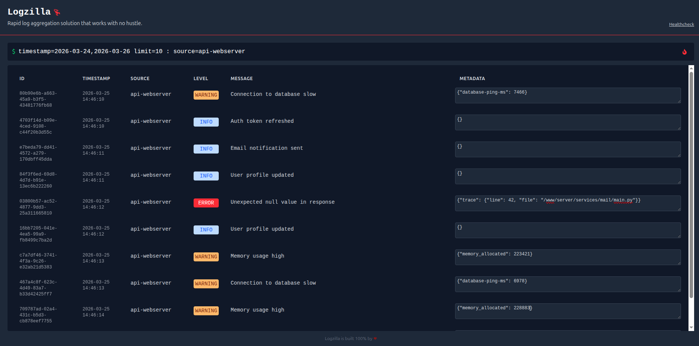

# LogZilla

**LogZilla is under development. Features and APIs may change as we work towards a stable release. Please help Logzilla better by opening PRs or issues with your suggestions.**

---



Logzilla is a lightweight, high-performance tool for collecting, processing, and analyzing logs from various sources. It provides a flexible pipeline architecture that enables real-time log ingestion, transformation, and querying.

## Architecture

LogZilla consists of four core components that work together to provide a complete log management solution:

### Log Source

A source defines where LogZilla collects logs from. The system supports multiple source types including:

- **File sources:** Tail log files with automatic rotation handling
- **Shell commands:** Gather logs from sources like docker, journald, etc.
- **Network sockets:** Collect logs from TCP/UDP endpoints (coming soon)
- **Redis:** Subscribe to Redis channels for log messages (coming soon)
- **Kafka:** Consume from Kafka topics (coming soon)

### Processor

Processors transform raw log lines into structured, queryable data. After processing, each log has a set fields including id, source, message, level (debug, info, warn, error, fatal, unknown), timestamp, and metadata. Built-in processors include:

- **JSON parser:** Extract fields from JSON-formatted logs
- **Lua processor:** Write custom processing logic using Lua scripts. Examples of lua processors are present at [docs/lua/script.lua](docs/lua/script.lua).
- **Grok patterns:** Support for common log format patterns (coming soon)

### Querier

The querier component provides a search interface for querying processed logs. It supports:

- Full-text search across all log fields
- Time-range based queries
- Field-specific filtering

### UI

A modern web-based interface that enables users to:

- Visualize log data in real-time (not real-time at the time)
- Set up alerts and notifications (TODO)
- Explore logs through an intuitive search interface
- Manage configurations and processing rules (TODO)

## How to Install

Just download Logzilla suitable for you architecture from the releases section. In future a docker image will be proved for sake of simplicity.

## Basic Usage

### Configuration File Structure

LogZilla uses a YAML configuration file to define the entire log processing pipeline which you can find an example of it in [`config-example.yaml`](config-example.yaml).

### Starting LogZilla

Once you have your configuration file ready, start LogZilla with:

```bash
logzilla -config /path/to/config.yaml
```

### Common Operations

Please refer to config-example.yaml to get better view of what can be done with Logzilla.

#### 1. Tail a log file in real-time

```yaml
sources:
  - type: file
    processors: ["json-parser"]
    config:
      name: realtime-logs
      path: "/var/log/application/current.log"

  - type: shell
    config:
      name: api-logs
      command: "python3 -u /www/your-api-server/main.py" # Use `-u` for python if you don't want python to buffer your logs.
      processors: ["sensetive-logs-processor"]
```

#### 2. Apply multiple processors to enrich logs

```yaml
sources:
  - type: file
    processors: ["json-parser", "geo-enricher", "anomaly-detector"]
    config:
    name: enriched-logs
      path: "/var/log/nginx/access.log"

processors:
  - name: json-parser
    type: json

  - name: geo-enricher
    type: lua
    config:
      script-path: "/etc/logzilla/processors/geo.lua"

  - name: anomaly-detector
    type: lua
    config:
      script-path: "/etc/logzilla/processors/anomaly.lua"
```

#### 3. Query logs using the command line

Query language of Logzilla (Quzilla) is very simple to use query language. Keep in mind that a few changes are expected to be applied to query language in order to make more easy to use.

Each query exists of two parts:

1. **Control section:** Used to define limit, timestamp, cursor, and order of result.
2. **Filter section:** Used to write the actual filter.

Control section comes first, followed by a colon, and filter section: `<control> : <filter>`

Examples:

- `cursor=xxx sort=message : level=info,warn & (source=main-server | metadata.ip_addr="12.10.67.12")`
- `limit=90 : message~"while calling api"`
- `: !(message~"user registered" | level=info & metadata.success=true)`: Use single colon before queries with only filter statements.
- `: metadata.callback_url != null`
- `:`: Yup, single colon is allowed as well.

#### Control section

Writing control statements are easy. You have a set of fields:

`sort`: Use field names with a dash to indicate descending order and omit dash for ascending order. For example: `sort=-level,source`

`timestamp`: The format to define timestamp range is `timestamp=<start>,<end?>`. If start is greater than end, logs are sorted by timestamp in ascending order, otherwise logs are sorted in descending order. You can omit end timestamp which will default to now. Also keep in mind that only ISO format and `%Y:%M:%D` formats are supported for parsing timestamp.

`cursor`: Cursor is used to get the next batch of current query. Syntax is `cursor=<cursor>`.

`limit`: Is used to define max number of results in each batch. You can use values in range [1, 1000]. Syntax is `limit=<limit>`.

All the fields in control section are optional.

A real-world example of control section: `limit=10 timestamp=2020-10-12,2020-10-14`

#### Filter section

Use filter section to define the actual filters. Syntax is quite simple: `<field_name><operator><values>`

Supported field names: `id`, `source`, `level`, `timestamp`, `message`, `metadata.<whatever>`.

Supported operators:

- `=`: If used with multiple values, it will not correspond to equality, and will be interpreted as IN operator.
- `!=`: If used with multiple values, it will not correspond to equality, and will be interpreted as IN operator.
- `~`: This is LIKE operator. It finds **strings** based on similarity. For now it doesn't support multiple values.
- `>=`, `>`, `<`, `<=`: Used with integers and floats. Does not support multiple values for now.

Values format:

- Use comma as separators if you want to enter multiple values. Note that not all operators support multiple values.
- Use parentheses to enforce order of operation.
- Use exclamation mark as negator.

### Performance Tuning

For production deployments, adjust these parameters based on your workload:

```yaml
# Increase parallelism for high-volume logs
processor-workers-count: 50

# Larger buffers for bursty traffic
raw-logs-buffer-size: 10000
processed-logs-buffer-size: 5000

# More frequent flushes for real-time requirements
storage-flush-interval: 1s
```

## TODOs

Logzilla is still under development. There are a couple of features that need to be improved or added:

- [ ] Live trailing
- [ ] Saving logs with failed processing job
- [ ] Authentication, authorization, and account management for admin UI
- [ ] Config management through UI
- [ ] Log sources like TCP/UDP, etc.
- [ ] Write ahead logging

## How to Contribute

We welcome contributions from the community! Please read the [CONTRIBUTING.md](docs/CONTRIBUTING.md) file for detailed information about:

- Development environment setup
- Coding standards and guidelines
- Pull request process
- Testing requirements
- Code review process

### Quick Start for Contributors

1. Fork the repository
2. Clone your fork: `git clone https://github.com/your-username/logzilla.git`
3. Create a feature branch: `git checkout -b feature/amazing-feature`
4. Make your changes and write tests
5. Run the test suite: `make test`
6. Commit your changes: `git commit -m 'feat: an amazing feature'`
7. Push to your branch: `git push origin feature/amazing-feature`
8. Open a Pull Request

For major changes, please open an issue first to discuss what you would like to change.

### Development Resources

- **Issue Tracker:** GitHub Issues
